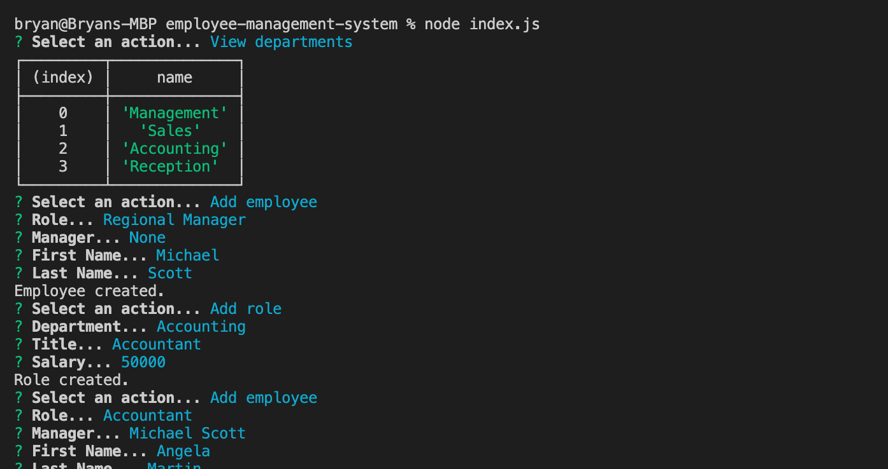

# Employee Management System

## Description
This is an express application that manages the employees within an organization.
## Table of Contents
- [Installation](#installation)
- [Usage](#usage)
- [Contributions](#contributions)
- [Testing Information](#testing)
- [License](#license)
- [Questions](#questions)
## Installation
npm install
## Usage
node index.js

## Contributions

## Testing
To test, run 'npm test -- No testing provided.'.

## License
This project is covered under a/an MIT license. For more information see GitHub documentation on licensing a project [here](https://docs.github.com/en/communities/setting-up-your-project-for-healthy-contributions/adding-a-license-to-a-repository).

## Questions
​For questions, get in touch on [GitHub](https://github.com/bryan-barnes12/) or email me at [theonlysweetbeebles@gmail.com](mailto:theonlysweetbeebles@gmail.com).
    